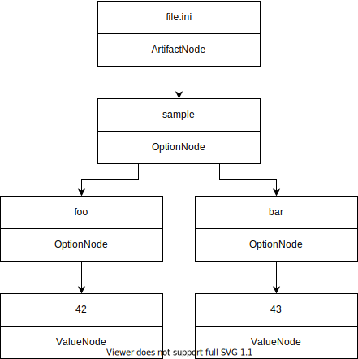

Plugins
=======

Files belonging to configuration concepts like Maven (:code:`pom.xml`) or Docker (:code:`Dockerfile`) are handled by concept plugins, those, that are identified as (potential) configuration files by their file type (like :code:`.json` or :code:`.ini`), by file type plugins.

These plugins fulfill the same tasks but concept plugins have higher priority when it comes to deciding which plugin is responsible for parsing a certain file.

Creation of new plugins
-----------------------

Reading this documentation should help you get started with creating plugins in order to let the tool parse new types of configuration.

Each plugin inherits from the base class :code:`Plugin` and must override the abstract methods :code:`_parse_config_file` and :code:`is_responsible`.

The :code:`_parse_config_file` method is given a file path and optionally the :code:`project_node`.
The method returns an :code:`ArtifactNode` that will be added to the configuration network.

For parsing a specific file, a plugin is supposed to create an :code:`ArtifactNode` for that file, optionally adding it to the :code:`project_node`:

.. code:: python

    artifact = ArtifactNode(
            file_path=abs_file_path,
            rel_file_path=rel_file_path,
            concept_name=self.concept_name,
            project_root=root,
        )

For every :code:`ArtifactNode`, a default option for the file name is added.

The purpose of :code:`_parse_config_file` is to extract configuration options and their values from the configuration file.
Options are created as :code:`OptionNodes` and are added to the :code:`ArtifactNode`, while their values are created as :code:`ValueNodes` and are added to their :code:`OptionNodes`.

For example, when parsing the following example file:

.. code::

   [sample]
   foo=42
   bar=43

The parser for :code:`.ini` files will produce create following sub-network:

To reflect configuration that has sections, children of :code:`OptionNodes` can also be :code:`OptionNodes`.
Moreover, options can specify a configuration type if known.
Those configuration types are a crucial part of when it comes to link nodes.

Option Nodes with Multiple Values
^^^^^^^^^^^^^^^^^^^^^^^^^^^^^^^^^

A configuration option can have one or more values, and thus an :code:`OptionNode` can have one or more :code:`ValueNodes` as children.

Note that the detection of conflicts in the configuration will only work for options with a single value.
It is advised to avoid creating multi-value options in your plugin, and to instead create meaningful sub-options wherever possible.

For example, Dockerfiles may contain the :code:`COPY` instruction that takes two parameters (source and destination).
Instead of creating a :code:`COPY` :code:`OptionNode` with the source and destination values as children, the Dockerfile plugin creates a :code:`COPY` :code:`OptionNode` that has children named :code:`source` and :code:`destination` (these are also :code:`OptionNodes`), that each have a single :code:`ValueNode` as a child, containing the values of the :code:`COPY` command's source and destination parameters, respectively.

Option Nodes without Children
^^^^^^^^^^^^^^^^^^^^^^^^^^^^^

Please keep in mind that we want to maintain our network as lean as possible.
That means we only want to have nodes in our network that potentially are involved in meaningful configuration conflicts.

This, in particular, concerns option nodes, that don't lead to any value nodes.
Therefore childless option nodes should be removed by the responsible plugin.
Also keep in mind, that removing such option nodes might result in other childless option nodes that than have to be removed as well.